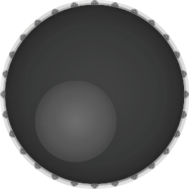
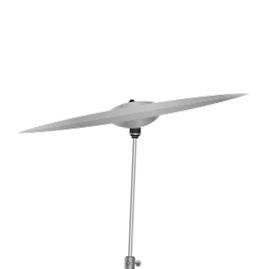
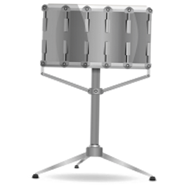
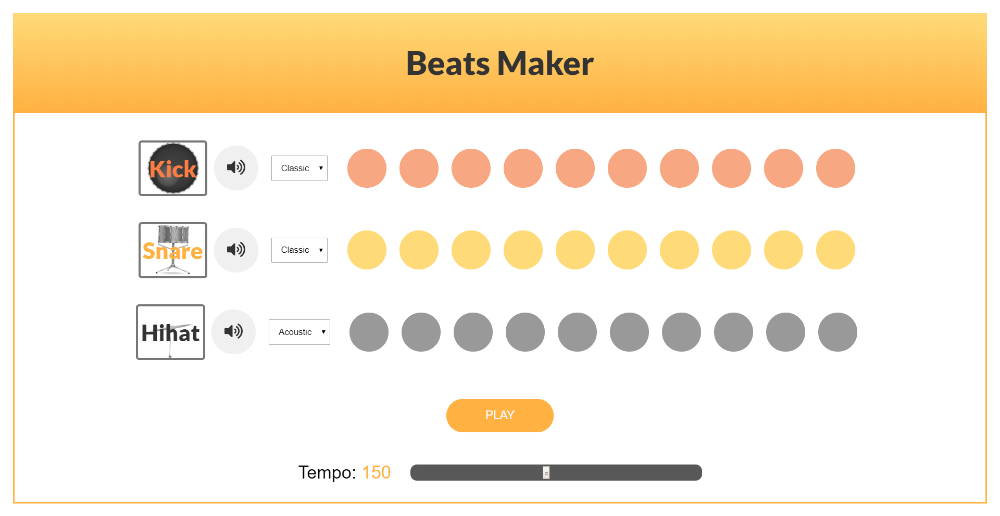

<br />
<p align="center">
  <a href="https://m90khan.github.io/Drum-Beats-Maker-WebApp/">
          
  </a>

  <h3 align="center">BeatMakerX---Drum Beats Generator</h3>

  <p align="center">
Play simple drum beats on a loop  <br />
    <a href="emailto:m90khan@gmail.com"><strong>Contact Me »</strong></a>
    <br />
    <br />
    <a href="https://m90khan.github.io/Drum-Beats-Maker-WebApp/">View Demo</a>
    
   </p>
</p>

## Table of Contents

- [About the Project](#about-the-project)
- [Process](#process)
- [Skills](#skills)
- [Code Snipet](#code)
- [Connect with me](#Contact)

---

### About the Project

- A recursive beat player of kick, snare and hihat based on tempo slider.

Live: https://m90khan.github.io/Drum-Beats-Maker-WebApp/


##### Process

- Setup environment including webpack.
- Find and add sounds into a folder.
- Implementation of HTML structure.
- Applied component based styling.
- Create a Class, add all the required querySelectors.
- Event Listener to Play the sounds when clicked on Play.
- Based on the Play, loop over all the box divs and look for --active class.
- If --active, play the sound based on specific class for each sound.
- data-\* attribute used for mute/unmute the sounds.
- Change the tempo of the sounds based on the tempo slider.

---

### Skills

[][youtube]
[][youtube]
[][youtube]
[][youtube]
[][youtube]
[][youtube]
[][youtube]
[][youtube]
[][youtube]
<br />
<br />

---

### Code Snippet

```javascript
repeat() {
    let step = this.index % 10;
    const activeBars = document.querySelectorAll(`.b${step}`);
    //loops over bars
    activeBars.forEach((bar) => {
      bar.style.animation = `playTrack .3s alternate  ease-in-out 2`;
      if (bar.classList.contains("--active")) {
        if (bar.classList.contains("kick-pad")) {
          this.kickAudio.currentTime = 0;
          this.kickAudio.play();
        }
        if (bar.classList.contains("snare-pad")) {
          this.snareAudio.currentTime = 0;
          this.snareAudio.play();
        }
        if (bar.classList.contains("hihat-pad")) {
          this.hihatAudio.currentTime = 0;
          this.hihatAudio.play();
        }
      }
    });
    this.index++;
    console.log(activeBars);
  }
```

---

### Connect with me:

[][youtube]

[][twitter]
[][linkedin]
[][instagram]
[][behance]
[][dribble]
<br />

---

[youtube]: https://www.youtube.com/channel/UC96rVfdTKsjZpREnH6CaCOw
[twitter]: https://twitter.com/m90khan
[linkedin]: https://www.linkedin.com/in/uxdkhan
[instagram]: https://www.instagram.com/uxd.khan/
[behance]: https://www.behance.net/Khan_Mohsin
[dribble]: https://dribbble.com/uxdkhan
